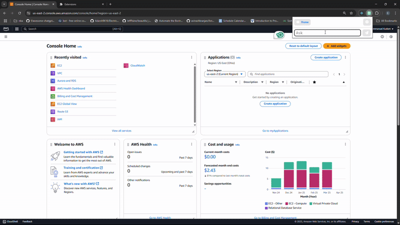

# 🧭 Companion: AWS Navigation



**Companion: AWS Navigation**
Navigate AWS faster with an intelligent and context-aware companion.

**Document contents**

- [Overview](#-overview)
- [Features](#-features)
- [Prerequisites](#prerequisites)
- [Getting Started](#-getting-started)

## 📌 Overview

Companion: AWS Navigation is a lightweight Chrome extension designed to supercharge your workflow in the AWS Console. It provides intelligent, context-aware navigation tools that adapt based on the AWS service you're currently viewing. Whether you're hopping between EC2, S3, IAM, or other services, Companion saves time, reduces friction, and improves your experience in the cloud.

No more digging through menus. Companion shows the most relevant links to you, right when and where you need them.

## 📦 Features

    - 🔍 Chat input feature to make requests
    - 🧠 Context-aware reponses based on your current AWS Console page
    - 🗂️ Overlay card with written instructions for navigation
    - ⚡ Button-border highlighting for improved navigation
    - 🌙 Clean and minimal UI, designed to blend seamlessly with AWS

## Prerequisites

🧩 For Users (Installing the Extension)

    - **Google Chrome** (latest version recommended).
    - **AWS Console Access** logged into the AWS Console.

👨‍💻 For Developers (Building / Contributing)

    - OpenAI API Key
    - **Node.js** (v16 or higher recommended).
    - **npm** (comes with Node.js).

## 🚀 Getting Started

Follow these steps to install the extension locally for development or testing:

### **1. Clone the Repository**

```bash
git clone https://github.com/Kudom-E/Companion-AWS.git

```

### **2. Open Google Chrome extentions**

    chrome://extensions

### **3. Enable **Developer mode** using the toggle at the top right.**

### **4. Click `Load unpacked` and select the `extension` folder inside the cloned repo.**

### **5. Once installed, the `Companion` icon will appear in your Chrome toolbar.**

### **6. Pin it to your toolbar for easy access.**

### **8. Click the extension icon to open pop up.**

### **9. Click on the settings button at the top right of the pop up.**

### **10. Enter your OpenAI API key into the field and click on save.**

### **11. There should be a placeholder in the input saying "API Key saved."**

### **12. Click on the home button at the top right to navigate to the main part of the pop up."**

### **13. Enter a navigation instruction like "find ec2" to test."**
